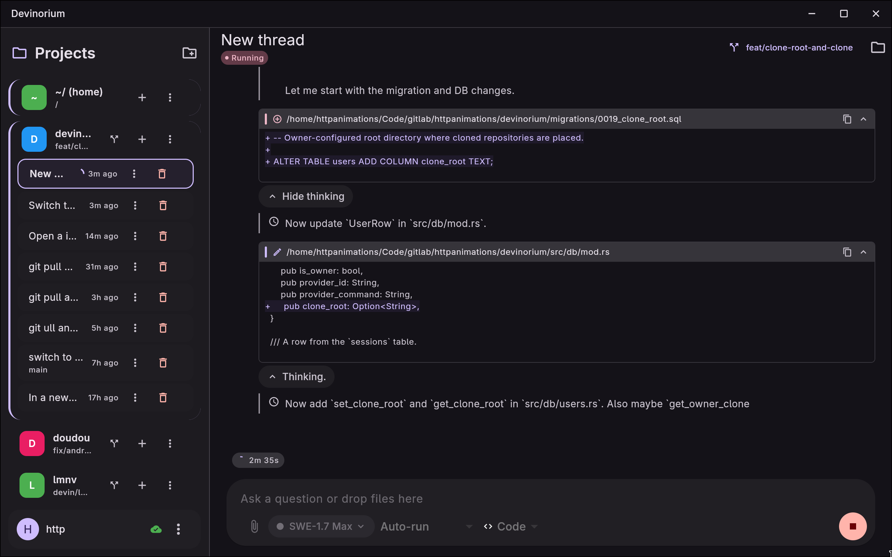
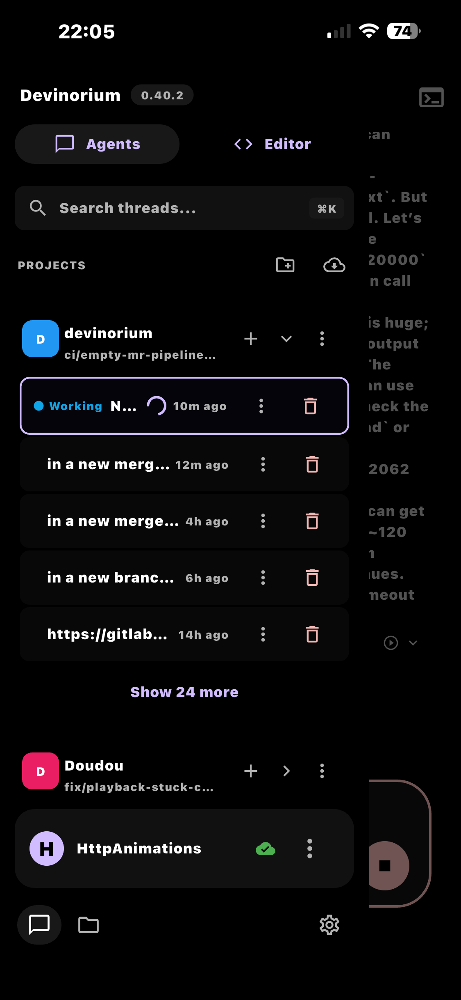
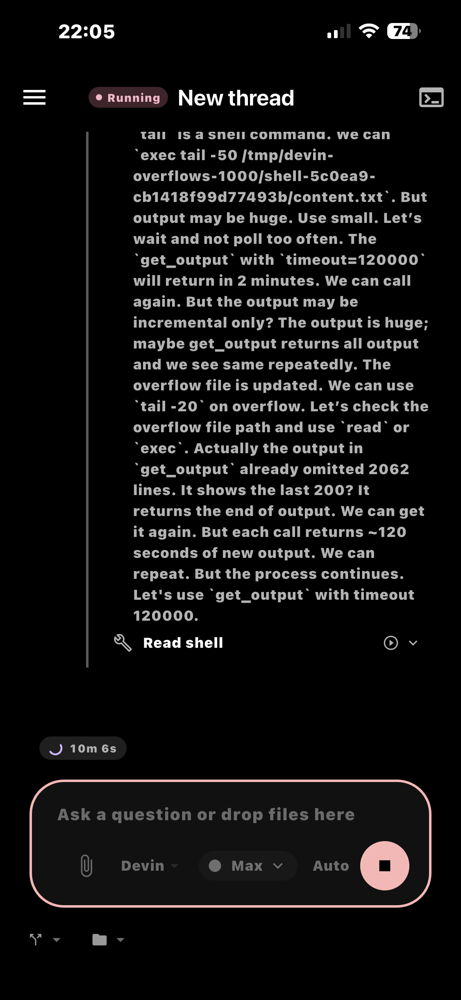
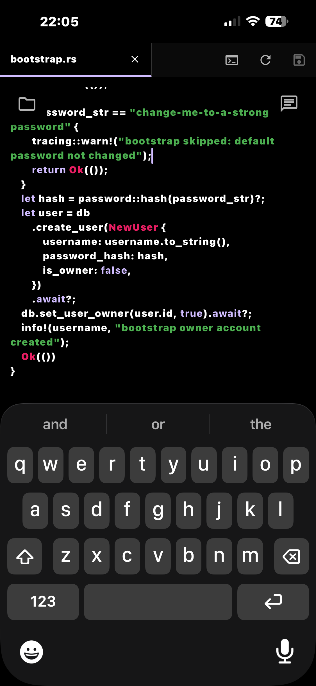

# Devinorium

A self-hosted web UI for AI coding agents.

- Backend: Rust (axum + tokio + SQLite)
- Frontend: Flutter web, built with `./scripts/build-flutter.sh` and embedded from `frontend/dist/` at compile time

<p align="center">
  
</p>

<p align="center">
  
  
  
</p>

## What it is

Devinorium lets you use coding agents from a browser. The Rust backend handles authentication, sessions, files, and provider calls; the provider layer is pluggable, so new backends can be added without touching the rest of the app.

## Supported providers

- [Devin CLI](https://devin.ai)
- [OpenCode](https://opencode.ai)
- [Codex CLI](https://github.com/openai/codex)
- [Grok Code](https://grok.com)

## Quick start

Prerequisites: Rust, the CLI for your chosen provider on PATH, and the Flutter SDK.
For the Devin provider, authenticate with `devin login`; for OpenCode, authenticate with `opencode auth login`; for Codex, authenticate with `codex login`; for Grok Code, authenticate with `grok login`.

```bash
git clone https://gitlab.com/HttpAnimations/devinorium.git
cd devinorium
cp .env.example .env
# Edit .env to set a real DEVINORIUM_BOOTSTRAP_PASSWORD.
# If it is unset or left as the placeholder, no owner account is created and you cannot log in.

./scripts/build-flutter.sh   # requires Flutter SDK; builds into frontend/dist/
cargo build --release          # embeds the freshly built frontend/dist/
mkdir -p data                # creates a place to store the database
./target/release/devinorium
```

Then open `http://localhost:7878` and log in with the bootstrap credentials.

## Configuration

All configuration is via environment variables. See `.env.example` for the full list.

| Variable | Default | Purpose |
|---|---|---|
| `DEVINORIUM_HOST` | `127.0.0.1` | Bind address |
| `DEVINORIUM_PORT` | `7878` | Listen port |
| `DEVINORIUM_SESSION_KEY` | (ephemeral) | Secret for signing session cookies; set a long random value for persistence |
| `DEVINORIUM_DB_URL` | `sqlite:data/devinorium.db?mode=rwc` | SQLite connection string |
| `DEVINORIUM_BOOTSTRAP_USERNAME` | `owner` | First-run owner username |
| `DEVINORIUM_BOOTSTRAP_PASSWORD` | (none) | First-run owner password; if unset, no owner is created |
| `DEVINORIUM_DEFAULT_MODEL` | `glm-5-2` | Default model for new threads |
| `DEVINORIUM_TRUST_PROXY` | `false` | Trust `X-Forwarded-For` behind a reverse proxy |
| `DEVINORIUM_MAX_BODY_BYTES` | `16777216` | Max request body size in bytes |
| `DEVINORIUM_SECURE_COOKIE` | `false` | Set the `Secure` cookie flag (enable over HTTPS) |
| `DEVINORIUM_ALLOWED_ORIGIN` | (unset or empty) | Explicit allowed origin for CSRF checks |
| `DEVINORIUM_TAILSCALE_BIN` | `tailscale` | Path to the tailscale CLI |
| `DEVINORIUM_TAILSCALE_SERVE` | `false` | Publish the server over `tailscale serve` at startup |
| `DEVINORIUM_TAILSCALE_SERVE_PORT` | `443` | Tailnet-side HTTPS port for the serve mapping |
| `DEVINORIUM_LOCAL_TOKEN` | (unset) | Bundled desktop mode: requests bearing this token map onto the passwordless `local` owner account, and the process exits when stdin closes. Set automatically by the desktop app; not for normal servers |

Database migrations run automatically on startup.

## Desktop apps (Linux, macOS, Windows)

Desktop builds bundle the `devinorium` server binary inside the app package
(`server/` next to the app executable). On launch the app spawns it on a
random loopback port with a fresh `DEVINORIUM_LOCAL_TOKEN`, so no login is
needed and other user accounts on the machine cannot use the API. The server
exits automatically when the app closes.

Remote servers still work: use "Add server" in Settings → Servers to connect
to a Devinorium instance running on another machine, and switch between it
and the bundled "This device" server from the sidebar. Tailscale remote
access is unavailable on the bundled server (it binds to loopback only), so
the Tailscale card in Settings → Servers is greyed out there.

For development, the bundled server is only found inside packaged builds. To
run it under `flutter run`, point the app at a binary you built yourself:

```bash
cargo build --release
flutter run --dart-define=DEVINORIUM_SERVER_BINARY="$PWD/target/release/devinorium"
```

## Testing

```bash
cargo fmt -- --check
cargo clippy --all-targets -- -D warnings
cargo test
```

Stricter `clippy::pedantic` and `clippy::nursery` lints can be triaged with `cargo clippy --all-targets -- -W clippy::pedantic -W clippy::nursery` and enabled incrementally.

## Deployment

Devinorium serves HTTP only. For remote or public access, put it behind a reverse proxy or tunnel that terminates TLS. See [docs/deployment.md](docs/deployment.md) for detailed examples.

## License

AGPL-3.0-only. See [LICENSE](LICENSE).
